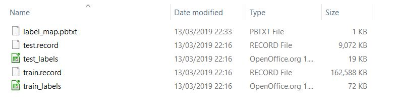
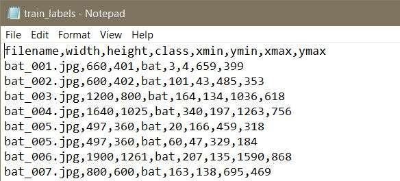
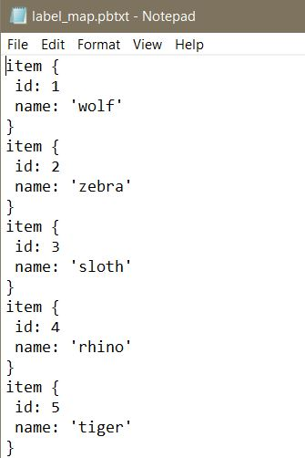

## Data folder

This is where the summary of your labeled data resides. It contains the `PBTXT`, the `CSV` and the `RECORD` files we generated. For details, please check my post at [Guacamole Data Science](https://luiztauffer.github.io/guacamole-data-science/posts/2019-03-14-identifying-cool-mammals/).

The folder with all the files should look like this:

The `CSV` files will look similar to this:

The `PBTXT` file will look similar to this:

