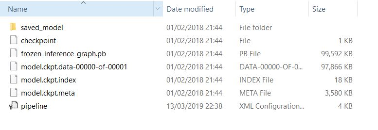

## Pre-trained model

This is where you store the pre-trained models you find at the [Model Zoo](https://github.com/tensorflow/models/blob/master/research/object_detection/g3doc/detection_model_zoo.md). Once the files have been downloaded, it should look like this:

