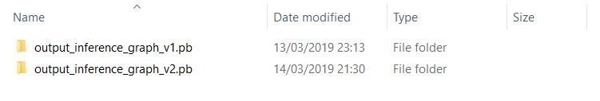
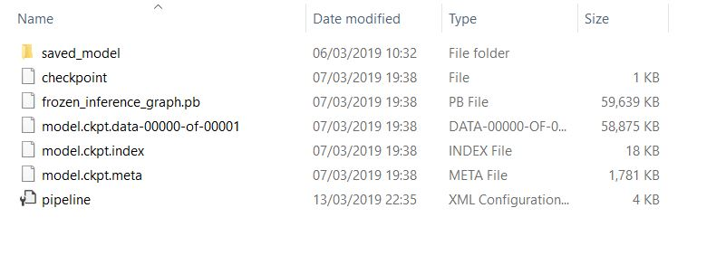

## Trained inference graphs

This is where you will export the froyen graphs to use later for inference. If you have exported multiple models, it will look like this:

and inside each exported model's folder, you'll see the model's files:

